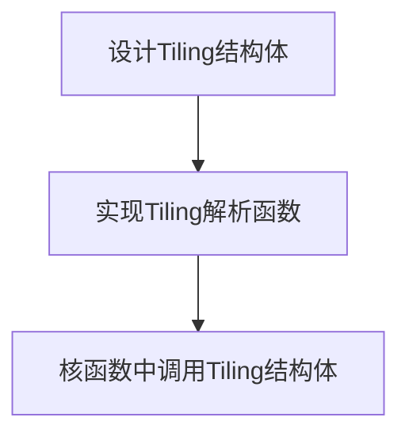

## Ascend C算子开发 Part2 Tiling计算与调试

## Declaration

本文使用了 AIGC 来提高效率，其中可能存在谬误，我已尽力检查并校对，但仍不保证完全准确，欢迎指正。

## Tiling

Tiling实际上就是对输入数据在CopyIn、Compute、CopyOut阶段前做的数据切分。

- 每次搬运的一部分（如`DataCopy`）的一部分数据块叫做Tiling块
- 根据算子中不同输入形状确定搬入基本块大小的算法叫做Tiling算法（或者时髦一点叫Tragedy，Policy）
- 实现tiling的函数（一般在Host侧的Tiling头文件中），叫做Tiling函数

## AscendC中的TIling

Tiling在AscendC中直接表现为一个struct，简称**Tiling结构体**。

- Tiling结构体的定义在Tiling头文件中，其中的结构体参数表示如何对数据进行切分，以及决定计算过程的一些细节，在Host侧实例化，并通过指针传入kernel函数中，如：
  ```cpp
  struct AddCustomTilingData{
      uint32_t totalLength;
      uint32_t tileNum;
  }
  
  __global__ __aicore__ void add_custom(GM_ADDR x, GM_ADDR y, GM_ADDR z, GM_ADDR workspace, GM_ADDR tiling)
  ```

- Tiling结构体中的值在host侧确定，根据入参数据完成结构体参数的基本运算，并实施搬运分别再host和device为结构体申请空间，将其host to device，H2D操作如下：

  ```cpp
  aclrtMallocHost((void**)(&tilingHost), tilingSize);
  aclrtMalloc((void**)&tilingDevice, tilingSize, ACL_MEM_MALLOC_HUGE_FIRST);
  aclrtMemcpy(tilingDevice, tilingSize, tilingHost, tilingSize, ACL_MEMCPY_HOST_TO_DEVICE);
  ```

## 固定、动态Shape中的tiling

在Part1 sinh的实现代码中实际上所用到的

```cpp
constexpr int32_t TOTAL_LENGTH = 8 * 2048;                            // total length of data
constexpr int32_t USE_CORE_NUM = 8;                                   // num of core used
constexpr int32_t BLOCK_LENGTH = TOTAL_LENGTH / USE_CORE_NUM;         // length computed of each core
constexpr int32_t TILE_NUM = 8;                                       // split data into 8 tiles for each core
constexpr int32_t BUFFER_NUM = 2;                                     // tensor num for each queue
constexpr int32_t TILE_LENGTH = BLOCK_LENGTH / TILE_NUM / BUFFER_NUM; // separate to 2 parts, due to double buffer

...
    
extern "C" __global__ __aicore__ void sinh_custom(GM_ADDR x, GM_ADDR y)
{
    KernelSinh op;
    op.Init(x, y);
    op.Process();
}
```

就是固定Shape中的tiling，而在动态shape中的tiling中

```cpp
extern "C" __global__ __aicore__ void sinh_custom(GM_ADDR x, GM_ADDR y, GM_ADDR workspace, GM_ADDR tiling)
{
	// 解析tiling的逻辑
	...
    KernelSinh op;
    op.Init(x, y);
    op.Process();
}
```

实际上就变成了这样


结合这两张图来看，可见Tiling是核间独立的

### 动态Shape场景下的tiling结构体

主要流程



> Tiling结构体中的信息
>
> - TOTAL_LENGTH: 总共需要计算的数据个数
> - TILE_NUM: 切分的数据分块个数
> - USER_CORE_NUM为参与并行计算使用的核数，有独立接口`GetBlockNum()`可以在核函数中获得
>

## 动态Shape场景下算子类定义中的额外变量

### 算子核函数中的workspace

在算子核函数中动态Shape的API定义会传入workspace，例如

```cpp
extern "C" __global__ __aicore__ void sinh_custom(GM_ADDR x, GM_ADDR y, GM_ADDR workspace, GM_ADDR tiling)
{
	// 解析tiling的逻辑
	...
    KernelSinh op;
    op.Init(x, y);
    op.Process();
}
```

该变量是在GM(Global Memory)上申请的额外空间

### 算子类中的private变量

动态shape场景下，算子类一般会多出几个额外变量：

```cpp
uint32_t blockLength; // number of calcu on each core
uint32_t tileNum;
uint32_t tileLength;
```

### Init函数中的Tiling处理

动态shape下，基本就是复现静态shape下的宏定义中的计算

```cpp
ASSERT(GetBlockNum() != 0 && "block dim can not be zero!");
this->blockLength = totalLength / GetBlockNum();
this->tileNum = tileNum;
ASSERT(tileNum != 0 && "tile num can not be zero!");
this->tileLength = this.blockLength / tileNum /BUFFER_NUM;
```

## Sub Summary


 ## CPU与NPU孪生调试

孪生调试指同一份代码，CPU/NPU两侧的调试运行

- CPU调试主要代码逻辑与计算精度调试，主要使用gdb以及io
- NPU调试主要负责性能问题与算子同步问题，主要使用打点图与profile


### CPU模式下的算子调试

通过Host侧CPU进行仿真调试，相同代码算子可在CPU进行精度调试，并无缝切换到NPU下进行。

- gdb调试中需要注意的是，由于会有多个子进程去仿真npu的程序运行，因此需要`set follow-fork-mode chlid`
- 并且所谓“无缝切换”不支持对打印指令的运行，强行写入核函数会发现，这些指令只会输出空值，需要使用内置宏`__CCK_KT_TEST__`加以区分

### NPU模式下的算子功能调试

本质是使用Model仿真器运行算子，得到数据的计算模拟和指令的时序仿真，运行后会得到`*.dump`与`*.vcd`文件，用于进行算子运行过程的分析

- 每个AICore会生成一个core*_summary_log文本文件例如core_summary_log。存放端到端的信息，例如执行了多少个cycle以及流水线的占用时间，查看是memory bound 还是 vector bound
- 每个AICore会生成一个*.vcd文件，例如core0_wave.vcd。可以得到一个波形图，看到高低电平侧面分析是否有工作。通过GTKWave查看pipeline工作流程。

使用Model仿真器实际上走的还是NPU的编译过程，只是实际调用的动态库文件替换成了Model仿真器指定的库文件，从而达到了“真实上板”与“仿真上板”的目的，运行model仿真不需要使用真实的NPU环境。

## REF

1. Huawei docs(W3)
1. Huawei ilearning
1. 