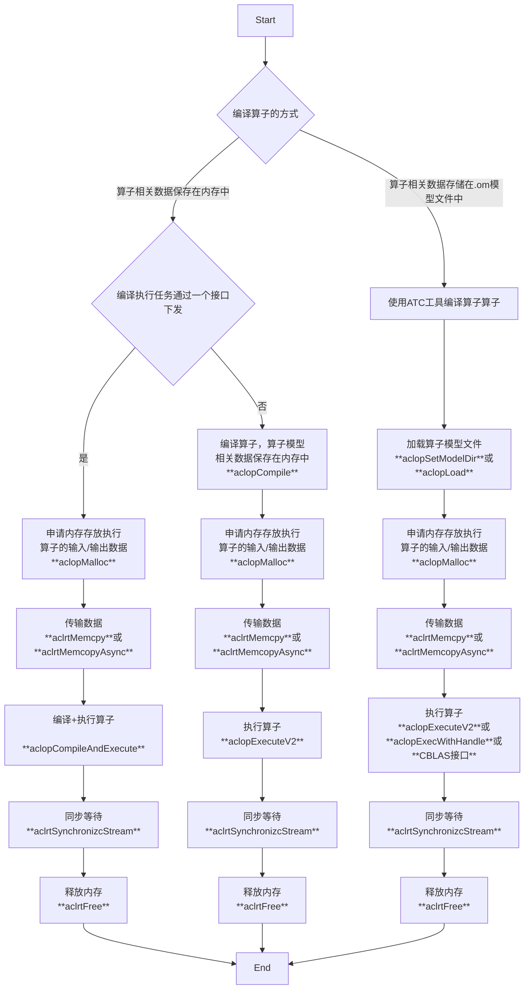

## Ascend C算子开发 Part4 算子调用与测试

## 自定义算子调用方式

两种调用方式

- 通过Kernel直调。快速验证逻辑
- 通过算子交付件的标准流程调用。软件版本迭代


### 单算子调用

单算子调用有两种调用方式

- ACLOP（模型执行）：基于C/CPP定义的API执行算子。无需进行离线转换
- ACLNN（API执行）：基于图IR执行算子。需要通过两种方式取一编译，然后运行
  - 编译
    - 通过ATC工具将Ascend IR定义的单算子描述文件编译成算子om模型文件
    - 在编译单算子
  - 调用AscendCL接口加载算子模型，最后使用AscendCL接口执行算子

> 单算子API执行时显而易见的，会有ACLNN。
>
> 例如对于Add_Custom，会有一个显式的调用方式。
>
> 而对于单算子执行模型，可能就会有aclopCompileAndExecute或者aclopExecute。执行接口中就不会显式的带有算子的名字


#### 单算子API执行（aclnn的调用方式）

两段式接口

- aclnnXXXGetWorkspaceSize：按照workspace的大小申请Device侧的内存。
- aclnnXXX：调度对应单算子的二进制进行计算。


这里没有说明Event之类的模块，是仅必要的API调用。

### 单算子模型执行




这么复杂，~~我在造火箭吗~~。


### 调用样例演示


## Ascend C算子测试

### UT/ST 简介

Unit Test & System Test 都是基本概念


### 自定义算子的UT测试

图中对ut测试的描述十分详细。补充在演示中提到的测试命令

```sh
set ASCEND_HOME=/usr/local/Ascend/lastest
op_ut_run --case_files= tset_add_custom_impl.py		\
		  --data_path=./data						\
		  --simulator_data_path=./model				\
		  --simulator_lib_path=$ASCEND_HOME/toolkit/tools/simulator	\
		  --simulator_mode=ca						\
		  --soc_version=Ascend910A					\
		  --case_name=add_custom_1					\
		  --ascendc_op_path=add_custom.cpp			\
		  --block_dim=8								
```

> op_ut_run 工具会产生许多文件包括`data/`，`model/`，`report`...，其中report是有关测试结果的报告，model是算子相关的dump，REF3中有提到该工具的文档，可以将dump文件进行一个转化

在自定义算子UT测试脚本中总体通过多次调用`ut_case.add_precision_case()`函数去调用函数。

由于浮点数的原因，这里使用两个0.05去判断整体的误差概念。然而，这仅仅只是一种朴素的判断方式，通常我们认为误差是“左右随机分布”的，然而可能由于某些原因，当出现统计学上的逻辑误差（例如计算值整体略微偏大），这里是检查不出来的。 

- **absolute tolerance, atol**: 用于限制结果之间的绝对差
  $$
  ∣xtest−xgolden∣≤atol
  $$

- **relative tolerance, rtol**: 同于限制结果之间的相对误差
  $$
  \frac{∣xgolden-xtest∣}{∣xgolden∣}≤rtol
  $$

通常情况下（pytest,numpy.testing.assert_alloclose），这两者会同时存在
$$
∣xtest−xgolden∣≤atol+rtol×∣xgolden∣
$$


### 自定义算子ST测试

本质是通过生成om离线模型和算子模式（Aclop）应用程序使用device执行检验Ascend C算子的运行结果，依赖DeviceCANN开发套件包中的ST测试工具：msopst，支持生成算子的ST测试用例并在硬件环境中执行。

这里执行的算子程序会自动呈现一个报表`st_report.json`。并且会回显期望算子和实际算子的输出对比结果。

这里同样补充一下样例中的测试脚本

```sh
set ASCEND_HOME=/usr/local/Ascend/lastest
export DDK_PATH=$(ASCEND_HOME)
export NPU_HOST_LIB=$(ASCEND_HOME)/runtime/lib63/stub
msopst creat -i add_custom.cpp -out ./output
msopst run -i output/AddCustom_case.json -soc Ascend910B1 -out ./output -c Test_AddCustom_001 --err_thr "[0.01,0.05]"
```


## REF

1. Huawei w3
2. Huawei ilearning
3. [op_ut_run工具使用-附录-Ascend C算子开发-CANN商用版7.0.0开发文档-昇腾社区](https://www.hiascend.com/document/detail/zh/canncommercial/700/operatordev/Ascendcopdevg/atlas_ascendc_10_0105.html)
